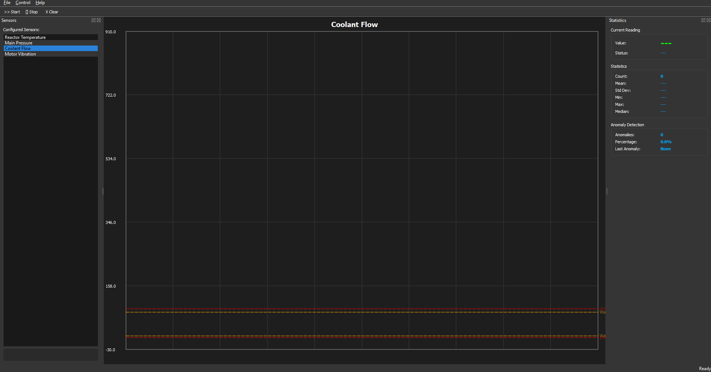
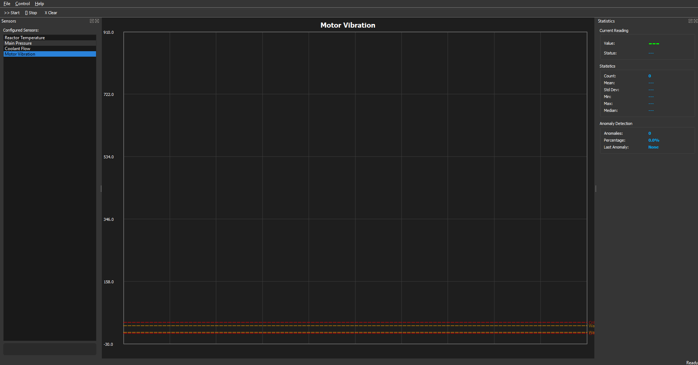
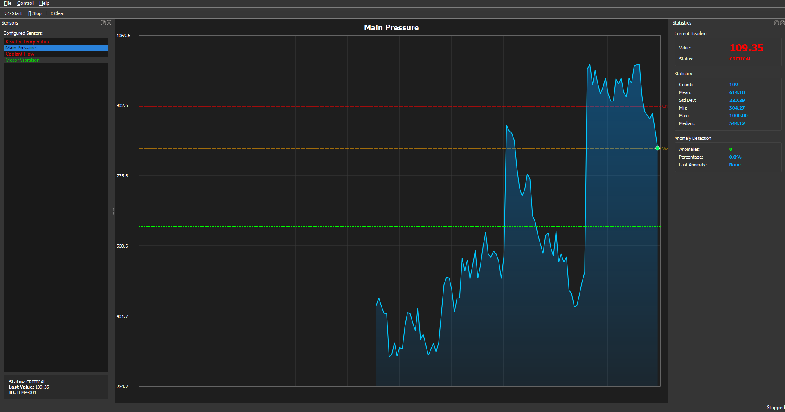
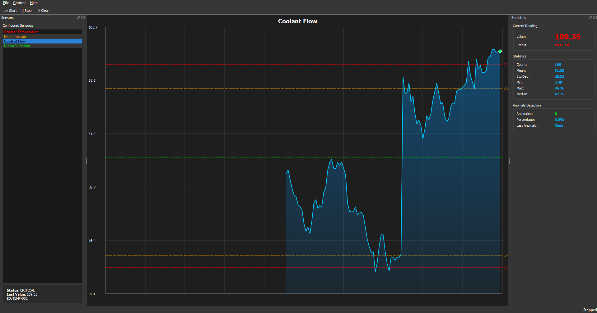
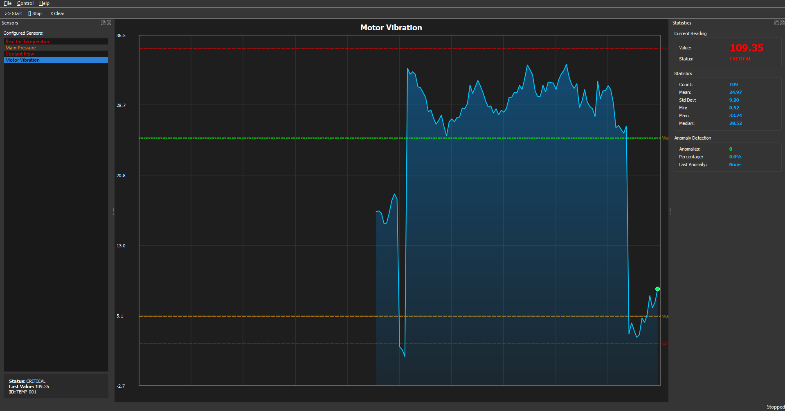
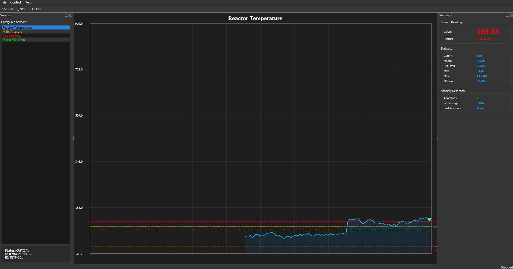

# SensorCorePro

<div align="center">


**A C++20 sensor monitoring application with real-time visualization, statistical analysis, multi-algorithm anomaly detection, and SQLite persistence — built with TDD.**

</div>

---

## Table of Contents

- [What This Project Does](#what-this-project-does)
- [Architecture](#architecture)
- [Core Concepts](#core-concepts)
  - [Sensor Model and Validation](#sensor-model-and-validation)
  - [Data Simulation](#data-simulation)
  - [Statistical Analysis](#statistical-analysis)
  - [Anomaly Detection](#anomaly-detection)
  - [Thread-Safe Queue and Multithreading](#thread-safe-queue-and-multithreading)
  - [SQLite Persistence](#sqlite-persistence)
  - [Qt5 GUI](#qt5-gui)
- [Mathematical Reference](#mathematical-reference)
- [Technology Stack](#technology-stack)
- [Project Structure](#project-structure)
- [Building](#building)
- [Running](#running)
- [Test Suite](#test-suite)
- [Design Patterns](#design-patterns)
- [C++20 Features Used](#c20-features-used)


---

## What This Project Does

SensorCorePro monitors four simulated sensors simultaneously — **Reactor Temperature**, **Main Pressure**, **Coolant Flow**, and **Motor Vibration** — at 10 Hz. For each incoming reading it:

1. Validates the value against a strict threshold hierarchy (Normal / Warning / Critical / Invalid)
2. Pushes the reading into a thread-safe queue consumed by the GUI
3. Computes full descriptive statistics every 10 readings (mean, std dev, percentiles, skewness, kurtosis)
4. Runs anomaly detection using a configurable algorithm (Z-Score by default)
5. Renders the live data stream on a custom `QPainter`-based chart with threshold lines, gradient fill, and a green current-value dot
6. Stores every reading in SQLite with millisecond-precision timestamps

Sensor data is generated by a mean-reverting stochastic simulation with configurable noise, drift, and a 2% anomaly injection probability per reading. There is no real hardware involved — everything runs from simulated `SensorProducer` threads.


---


### Idle State — Before Monitoring Starts

The application opens with all four sensors listed in the left dock. The chart immediately renders the **warning** (orange dashed) and **critical** (red dashed) threshold bands from each sensor's `ThresholdSet`. No data line appears until `>> Start` is pressed. Statistics on the right show placeholder dashes.

**Main Pressure — Idle**


**Coolant Flow — Idle**



**Motor Vibration — Idle**



---

### Live Monitoring

After `>> Start`, a `QTimer` fires every 100 ms. Each tick calls `generateSimulatedReading()` for all four sensors, pushes the reading to the chart for the currently selected sensor, and refreshes the statistics panel every 10 readings. Sensor names in the left panel change color to reflect their current `SensorState`. The chart renders a cyan data line with a blue gradient fill underneath, a green dot at the latest point, and a green dotted mean line.

**Main Pressure — Live (CRITICAL: 109.35 Pa)**



*Count: 109 — Mean: 614.10 — Std Dev: 223.29 — Min: 304.27 — Max: 1000.00 — Median: 544.12*

**Coolant Flow — Live (CRITICAL)**



*Count: 109 — Mean: 51.25 — Std Dev: 28.53 — Min: 3.39 — Max: 96.36 — Median: 47.75*

**Motor Vibration — Live (CRITICAL)**



*Count: 109 — Mean: 24.97 — Std Dev: 9.20 — Min: 0.52 — Max: 33.24 — Median: 28.52*

---

### All 85 Tests Passing



```
core_tests.exe              23 tests     6 ms    
analysis_tests.exe          44 tests    17 ms    
multithreading_tests.exe    11 tests   468 ms    
database_tests.exe           7 tests   154 ms    
```

---

## Architecture

Six independently compiled CMake static libraries with a strict one-way dependency chain. No lower layer imports from a higher one.

```
GUI  (Qt5 · QTimer · QPainter)
 |
Services  [TDD stubs — interfaces defined, implementations pending]
 |              |
Analysis       Core
StatisticalAnalyzer     Sensor · SensorReading · Types
AnomalyDetector         ThreadSafeQueue<T>
TrendAnalyzer [stub]    SensorProducer · DataManager · Alert
 |              |
Acquisition  [TDD stubs — CSVFileSource · SimulatedSource]
 |
Persistence  (SQLite · DatabaseManager · Repository stubs)
```

---

## Core Concepts

### Sensor Model and Validation

Each sensor is constructed from a `SensorConfig` struct carrying an `id`, `name`, `type`, `unit`, `validRange`, and `ThresholdSet`. The constructor calls `validateConfiguration()`, which enforces this strict hierarchy at construction time:

```
validRange.min  <  criticalLow  <  warningLow  <  warningHigh  <  criticalHigh  <  validRange.max
```

Any violation throws `std::invalid_argument` before the object exists. The four pre-configured sensors are:

| Sensor ID  | Name                | Unit | Valid Range | Warning Band | Critical Band |
|------------|---------------------|------|-------------|--------------|---------------|
| `TEMP-001` | Reactor Temperature | °C   | −40 to 150  | 0 to 80      | −20 to 100    |
| `PRES-001` | Main Pressure       | Pa   | 0 to 1000   | 100 to 800   | 50 to 900     |
| `FLOW-001` | Coolant Flow        | m³/h | 0 to 100    | 10 to 80     | 5 to 90       |
| `VIB-001`  | Motor Vibration     | m/s² | 0 to 50     | 5 to 25      | 2 to 35       |

`validateReading(double value)` checks the value against each threshold in order and returns a `ValidationResult` with `ReadingStatus` Normal, Warning, Critical, or Invalid. `SensorProducer` uses this result to update `SensorState` after every generated reading.

`SensorId` and `AlertId` are **strong types** wrapping `std::string`. They are not interchangeable with raw strings at compile time.

---

### Data Simulation

`SensorProducer` runs one `std::thread` per sensor. On every loop iteration it calls `generateReading()`, which applies a **mean-reverting stochastic process**:

$$x_t = x_{t-1} + \varepsilon_{\text{trend}} + \varepsilon_{\text{noise}} + \alpha\,(x_{\text{base}} - x_{t-1})$$

where:

- $x_{\text{base}}$ is the midpoint of the warning band
- $\varepsilon_{\text{noise}} \sim \mathcal{N}(0,\ 0.05 \cdot \text{range})$
- $\varepsilon_{\text{trend}} \sim \mathcal{N}(0,\ 0.01 \cdot \text{range})$
- $\alpha = 0.01$ pulls the value back toward $x_{\text{base}}$ each step (Ornstein-Uhlenbeck style mean reversion)

With probability $p = 0.02$, an anomaly is injected:

$$x_t = x_{\text{base}} + \text{sign} \cdot \text{range} \cdot m \cdot 0.3, \qquad m \sim \mathcal{U}(1.5,\ 3.0)$$

All values are clamped to `validRange` using `std::clamp`. The RNG is `std::mt19937` seeded from `std::random_device`.

The GUI's `generateSimulatedReading()` mirrors this same logic for each sensor with the same distributions and 2% anomaly probability. Per-sensor data is kept in a rolling 500-point buffer in `MainWindow::sensorData_`, and the chart uses a separate 200-point `std::deque<double>`.

---

### Statistical Analysis

`StatisticalAnalyzer` computes a `StatisticalResult` over a `std::vector<double>` or `std::vector<SensorReading>`. Basic statistics use a single `std::accumulate` pass; percentiles require a sorted copy.

#### Mean and Variance

$$\bar{x} = \frac{1}{n}\sum_{i=1}^{n} x_i$$

$$\sigma^2 = \frac{1}{n}\sum_{i=1}^{n}(x_i - \bar{x})^2$$

This is **population variance** (divides by $n$, not $n-1$).

#### Standard Deviation and Coefficient of Variation

$$\sigma = \sqrt{\sigma^2}, \qquad \text{CV} = \frac{\sigma}{|\bar{x}|}$$

#### Percentiles — Linear Interpolation

For percentile $p$, the interpolated index is:

$$\text{idx} = \frac{p}{100}\cdot(n - 1), \qquad f = \text{idx} - \lfloor\text{idx}\rfloor$$

$$P_p = x_{\lfloor\text{idx}\rfloor}\cdot(1 - f) + x_{\lceil\text{idx}\rceil}\cdot f$$

Computed: **P25, P50 (median), P75, P95, P99**. $\text{IQR} = P_{75} - P_{25}$.

#### Skewness — Fisher's Bias-Corrected Formula

$$\text{Skewness} = \frac{n}{(n-1)(n-2)} \sum_{i=1}^{n}\left(\frac{x_i - \bar{x}}{\sigma}\right)^3$$

Returns 0 if $n < 3$ or $\sigma = 0$.

#### Excess Kurtosis — Bias-Corrected

$$\text{Kurtosis} = \frac{n(n+1)}{(n-1)(n-2)(n-3)}\sum_{i=1}^{n}\left(\frac{x_i - \bar{x}}{\sigma}\right)^4 - \frac{3(n-1)^2}{(n-2)(n-3)}$$

Returns 0 for a normal distribution (excess kurtosis convention). Returns 0 if $n < 4$.

#### Moving Statistics

Simple Moving Average over the last $w$ samples:

$$\overline{x}_{\text{SMA}} = \frac{1}{w}\sum_{i=n-w+1}^{n} x_i$$

Exponential Moving Average with smoothing factor $\alpha = 0.1$ (configurable):

$$\text{EMA}_t = \alpha\,x_t + (1-\alpha)\,\text{EMA}_{t-1}$$

Moving standard deviation over the same window as the SMA.

#### Online Statistics — Welford's Algorithm

`OnlineStatistics` maintains running mean and variance without storing all values. On each new observation $x_n$:

$$\delta_1 = x_n - \bar{x}_{n-1}, \qquad \bar{x}_n = \bar{x}_{n-1} + \frac{\delta_1}{n}$$

$$\delta_2 = x_n - \bar{x}_n, \qquad M_{2,n} = M_{2,n-1} + \delta_1\cdot\delta_2$$

$$\sigma^2_n = \frac{M_{2,n}}{n}$$

This avoids numerical cancellation in naive two-pass computation. A unit test verifies that `OnlineStatistics` matches the batch result to within $10^{-4}$ on the dataset $\{2, 4, 4, 4, 5, 5, 7, 9\}$ (known variance = 4.0, known std dev = 2.0).

---

### Anomaly Detection

`AnomalyDetector` is configured via `AnomalyConfig`, which selects one of six `AnomalyMethod` values at runtime. Every detected `Anomaly` records its array index, value, score, detecting method, and a human-readable reason string built with `std::stringstream`. Results are **sorted descending by score** before being returned.

#### 1. Z-Score

$$z_i = \frac{|x_i - \bar{x}|}{\sigma}$$

Flagged if $z_i > \theta_z$ (default $\theta_z = 3.0$). Score equals $z_i$.

Bounds: $\left[\bar{x} - \theta_z\sigma,\quad \bar{x} + \theta_z\sigma\right]$

Requires at least 2 values and $\sigma > 0$.

#### 2. Modified Z-Score

Median Absolute Deviation:

$$\text{MAD} = \text{median}\!\left(\,|x_i - \tilde{x}|\,\right)$$

Modified Z-Score using the consistency constant $0.6745$ for normally distributed data:

$$M_i = \frac{0.6745\,|x_i - \tilde{x}|}{\text{MAD}}$$

Flagged if $M_i > 3.5$ (Iglewicz and Hoaglin recommendation). This method is more robust than Z-Score when the dataset contains multiple outliers that would inflate $\sigma$.

Detection bounds use the scaling factor $1.4826$ (the reciprocal of $\Phi^{-1}(0.75)$ for the normal distribution):

$$\tilde{x} \pm \theta_m \cdot 1.4826 \cdot \text{MAD}$$

#### 3. IQR (Tukey Fences)

$$L = Q_1 - k\cdot\text{IQR}, \qquad U = Q_3 + k\cdot\text{IQR}$$

Default $k = 1.5$ (standard Tukey fence). Requires at least 4 values and $\text{IQR} > 0$.

Score for a flagged value: $\dfrac{|x_i - \text{fence}|}{\text{IQR}} + k$

#### 4. Threshold

Absolute boundary check using `std::optional<double> absoluteMin` and `absoluteMax`. Either or both may be set. Score equals the magnitude of the boundary violation.

#### 5. Rate of Change

$$r_i = |x_i - x_{i-1}|$$

Flagged if $r_i > r_{\max}$ (default 10.0). Score $= r_i / r_{\max}$. Requires at least 2 values.

#### 6. Combined — Weighted Ensemble

Runs Z-Score, IQR, and Rate of Change in parallel. Results are merged into a `std::map<size_t, Anomaly>` keyed by array index. Scores accumulate with per-method weights:

$$s_{\text{combined}} = w_z\cdot s_z + w_{\text{IQR}}\cdot s_{\text{IQR}} + w_r\cdot s_r$$

Default weights: $w_z = 0.4$, $w_{\text{IQR}} = 0.3$, $w_r = 0.3$. An anomaly is emitted if $s_{\text{combined}} \geq 0.5$.

#### Severity Classification

| Score range | Severity |
|-------------|----------|
| $s < 3.0$ | Low |
| $3.0 \leq s < 4.0$ | Medium |
| $4.0 \leq s < 5.0$ | High |
| $s \geq 5.0$ | Critical |

---

### Thread-Safe Queue and Multithreading

`ThreadSafeQueue<T>` is a generic FIFO backed by `std::queue<T>`, a `mutable std::mutex`, and a `std::condition_variable`. Three pop strategies:

| Method | Behavior |
|--------|----------|
| `pop()` | Blocks until an item is available or `stop()` is called. Throws `std::runtime_error` if stopped with an empty queue. |
| `tryPop()` | Returns `std::nullopt` immediately if empty. No blocking. |
| `popWithTimeout(ms)` | Waits up to the given duration. Returns `std::nullopt` on timeout. |

`stop()` sets `bool stopped_` under the lock and calls `condVar_.notify_all()`, unblocking all waiting threads. `reset()` clears the flag so the queue can be reused. The mutex is `mutable` so that `empty()` and `size()` can be called on `const` instances.

`SensorProducer` uses `std::atomic<bool> running_` to control its thread loop, and `std::atomic<uint64_t> readingsGenerated_` as a lock-free counter. `stop()` sets `running_` to false then calls `thread_.join()`, so the destructor always waits for the thread to finish.

`DataManager` owns one `SensorProducer` per sensor (in an `std::unordered_map<string, unique_ptr<SensorProducer>>`), all sharing one `std::shared_ptr<ThreadSafeQueue<SensorReading>>`. Its destructor calls `stopAll()`, which stops all producers and then calls `queue_->stop()` to unblock any waiting consumers.

The concurrent stress test in `multithreading_tests.cpp` pushes 1000 items from 4 producer threads (250 each) and verifies zero item loss after the consumer has processed all of them.

---

### SQLite Persistence

`DatabaseManager` opens the database file in its constructor and closes it in its destructor. The public header forward-declares `struct sqlite3;` — `sqlite3.h` is only included in `DatabaseManager.cpp`, keeping it out of the public interface.

Schema created by `initialize()`:

```sql
CREATE TABLE IF NOT EXISTS sensor_readings (
    id        INTEGER PRIMARY KEY AUTOINCREMENT,
    sensor_id TEXT    NOT NULL,
    value     REAL    NOT NULL,
    timestamp INTEGER NOT NULL,
    status    INTEGER NOT NULL
);
CREATE INDEX IF NOT EXISTS idx_sensor_id ON sensor_readings(sensor_id);
CREATE INDEX IF NOT EXISTS idx_timestamp  ON sensor_readings(timestamp);
```

Timestamps are stored as `int64_t` milliseconds since the Unix epoch:

```cpp
std::chrono::duration_cast<std::chrono::milliseconds>(tp.time_since_epoch()).count()
```

Every prepared statement follows: `sqlite3_prepare_v2` → `sqlite3_bind_*` → `sqlite3_step` → `sqlite3_finalize`. No statement is left without a matching `finalize`.

Batch inserts in `storeReadings()` wrap all calls inside a single `BEGIN TRANSACTION / COMMIT / ROLLBACK`. `getSensorStats()` retrieves `COUNT / MIN / MAX / AVG` in one aggregation query grouped by `sensor_id`. `getReadings()` builds the SQL string dynamically based on which of the optional `startTime` and `endTime` parameters are set.

---

### Qt5 GUI

`main.cpp` creates a `QApplication` with the built-in **Fusion** style and a manually constructed dark `QPalette` with hardcoded RGB values. No external stylesheet file is used.

The `QMainWindow` layout:

- **Center**: `ChartWidget` — overrides `paintEvent` and draws entirely with `QPainter`. No Qt Charts library involved.
- **Left dock**: `SensorWidget` — a `QListWidget` with color-coded sensor names. Row selection emits `sensorSelected(int index)`.
- **Right dock**: `StatusPanel` — three `QGroupBox` sections (Current Reading, Statistics, Anomaly Detection) each with a `QGridLayout` of label pairs.

`ChartWidget` drawing order per `paintEvent`:

1. `drawGrid` — 6 horizontal + 11 vertical lines with Y-axis labels
2. `drawThresholds` — 4 dashed lines (2 orange warning, 2 red critical), drawn with a lambda to avoid repetition
3. `drawData` — a `QPainterPath` over the `std::deque<double>` (200-point rolling window), filled with a `QLinearGradient` (alpha 100 to 20) and a 2px cyan stroke. A 5px green ellipse marks the latest point.
4. `drawAnomalies` — 8px red ellipses at the indices stored in `anomalies_`
5. `drawStatistics` — a green dotted line at `stats_.mean`
6. `drawTitle` — 14pt bold white text centered at the top

The coordinate transform from data space to screen pixels:

$$x_{\text{screen}} = m_L + \frac{i}{N_{\max}} \cdot W_{\text{chart}}$$

$$y_{\text{screen}} = m_T + \frac{v_{\max} - v}{v_{\max} - v_{\min}} \cdot H_{\text{chart}}$$

where margins are $m_L = 60$, $m_T = 40$, $m_R = 20$, $m_B = 40$ (pixels), and $N_{\max} = 200$.

The `QTimer` interval is 100 ms (10 Hz). Statistics and anomaly detection are recomputed every **10 readings** to avoid running the full analysis on every frame.

---

## Mathematical Reference

| Quantity | Formula |
|----------|---------|
| Mean | $\bar{x} = \frac{1}{n}\sum x_i$ |
| Population Variance | $\sigma^2 = \frac{1}{n}\sum(x_i-\bar{x})^2$ |
| Standard Deviation | $\sigma = \sqrt{\sigma^2}$ |
| Coefficient of Variation | $\text{CV} = \sigma\,/\,|\bar{x}|$ |
| Percentile (linear interp.) | $P_p = x_{\lfloor i\rfloor}(1-f)+x_{\lceil i\rceil}f$ |
| IQR | $Q_3 - Q_1$ |
| Skewness (Fisher) | $\dfrac{n}{(n-1)(n-2)}\displaystyle\sum\!\left(\dfrac{x_i-\bar{x}}{\sigma}\right)^{\!3}$ |
| Excess Kurtosis | Bias-corrected 4th standardized moment; 0 for normal |
| EMA | $\alpha x_t + (1-\alpha)\,\text{EMA}_{t-1}$ |
| Z-Score | $(x - \bar{x})/\sigma$ |
| MAD | $\text{median}(|x_i - \tilde{x}|)$ |
| Modified Z-Score | $0.6745\,|x-\tilde{x}|\,/\,\text{MAD}$ |
| Mean-reversion step | $x_{t-1}+\varepsilon+0.01(x_{\text{base}}-x_{t-1})$ |

---

## Technology Stack

| Category | Library / Tool | Version | How it arrives |
|----------|---------------|---------|----------------|
| Language | C++ | 20 | Compiler (MSVC) |
| Build | CMake | 3.20+ | System |
| GUI | Qt5 — Widgets, Core, Gui, PrintSupport | system Qt | `find_package` |
| Database | SQLite3 | 3 | vcpkg `unofficial::sqlite3` |
| Unit Testing | Google Test + Google Mock | v1.14.0 | `FetchContent` |
| Logging | spdlog | v1.12.0 | `FetchContent` |
| Serialization | nlohmann/json | v3.11.3 | `FetchContent` |
| Code style | clang-format | — | `.clang-format` in repo root |

SQLite and Qt5 are the only dependencies that require manual installation. Everything else downloads and builds automatically during CMake configure.

---

## Project Structure

```
SensorCorePro/
|
|-- CMakeLists.txt
|-- .clang-format                            Google base, IndentWidth 4, ColumnLimit 100
|-- .gitignore
|-- README.md
|
|-- src/
|   |-- acquisition/
|   |   |-- include/acquisition/
|   |   |   |-- CSVFileSource.hpp
|   |   |   `-- SimulatedSource.hpp
|   |   |-- src/
|   |   |   |-- CSVFileSource.cpp
|   |   |   `-- SimulatedSource.cpp
|   |   `-- CMakeLists.txt
|   |
|   |-- analysis/
|   |   |-- include/analysis/
|   |   |   |-- AnomalyDetector.hpp         6-method detector + severity classification
|   |   |   |-- StatisticalAnalyzer.hpp     Descriptive stats + Welford online + EMA
|   |   |   `-- TrendAnalyzer.hpp           
|   |   |-- src/
|   |   |   |-- AnomalyDetector.cpp
|   |   |   |-- StatisticalAnalyzer.cpp
|   |   |   `-- TrendAnalyzer.cpp
|   |   `-- CMakeLists.txt
|   |
|   |-- core/
|   |   |-- include/sensorcore/
|   |   |   |-- Alert.hpp                   Alert entity with acknowledgement
|   |   |   |-- DataManager.hpp             Multi-sensor orchestration, shared queue
|   |   |   |-- Sensor.hpp                  Sensor entity + SensorConfig
|   |   |   |-- SensorProducer.hpp          Per-sensor thread + simulation
|   |   |   |-- SensorReading.hpp           Reading struct (auto-timestamped)
|   |   |   |-- ThreadSafeQueue.hpp         Generic FIFO (mutex + condvar)
|   |   |   `-- Types.hpp                   SensorId, AlertId, enums, Range, ThresholdSet
|   |   |-- src/
|   |   |   |-- Alert.cpp
|   |   |   |-- DataManager.cpp
|   |   |   |-- Sensor.cpp
|   |   |   |-- SensorProducer.cpp
|   |   |   `-- SensorReading.cpp
|   |   `-- CMakeLists.txt
|   |
|   |-- gui/
|   |   |-- include/gui/
|   |   |   |-- ChartWidget.hpp             Custom QPainter chart
|   |   |   |-- MainWindow.hpp              QMainWindow + QTimer setup
|   |   |   |-- SensorWidget.hpp            QListWidget sensor selector
|   |   |   `-- StatusPanel.hpp             Live stats dashboard
|   |   |-- src/
|   |   |   |-- ChartWidget.cpp
|   |   |   |-- main.cpp                    Fusion style + dark QPalette
|   |   |   |-- MainWindow.cpp
|   |   |   |-- SensorWidget.cpp
|   |   |   `-- StatusPanel.cpp
|   |   `-- CMakeLists.txt
|   |
|   |-- persistence/
|   |   |-- include/persistence/
|   |   |   |-- DatabaseManager.hpp         Full SQLite CRUD implementation
|   |   |   |-- Header1.h
|   |   |   |-- SQLiteReadingRepository.hpp 
|   |   |   `-- SQLiteSensorRepository.hpp  
|   |   |-- src/
|   |   |   |-- DatabaseManager.cpp
|   |   |   |-- SQLiteReadingRepository.cpp
|   |   |   `-- SQLiteSensorRepository.cpp
|   |   `-- CMakeLists.txt
|   |
|   `-- services/
|       |-- include/services/
|       |   |-- AlertService.hpp           
|       |   |-- AnalysisService.hpp         
|       |   `-- MonitoringService.hpp       
|       |-- src/
|       |   |-- AlertService.cpp
|       |   |-- AnalysisService.cpp
|       |   `-- MonitoringService.cpp
|       `-- CMakeLists.txt
|
`-- tests/
    |-- CMakeLists.txt
    `-- unit/
        |-- CMakeLists.txt
        |-- database_tests.cpp               7 tests
        |-- multithreading_tests.cpp         11 tests
        |-- acquisition/                     
        |-- analysis/
        |   |-- AnomalyDetectorTest.cpp      18 tests
        |   `-- StatisticalAnalyzerTest.cpp  26 tests
        |-- core/
        |   `-- SensorTest.cpp               23 tests
        `-- services/                        

---

## Building

### Requirements

- Visual Studio 2022 with the C++ workload
- CMake 3.20 or newer
- Qt5 with Widgets, Core, Gui, and PrintSupport components
- vcpkg for SQLite3

### Install vcpkg and SQLite

```powershell
git clone https://github.com/microsoft/vcpkg.git C:\vcpkg
cd C:\vcpkg
.\bootstrap-vcpkg.bat
.\vcpkg integrate install
.\vcpkg install sqlite3:x64-windows
```

### Build via Visual Studio

```
File -> Open -> Folder -> select SensorCorePro
Project -> Delete Cache and Reconfigure
Ctrl+Shift+B
```

### Build via Command Line

```powershell
mkdir build && cd build
cmake .. `
  -DCMAKE_TOOLCHAIN_FILE=C:/vcpkg/scripts/buildsystems/vcpkg.cmake `
  -DSENSORCORE_BUILD_TESTS=ON `
  -DSENSORCORE_BUILD_GUI=ON
cmake --build . --config Debug
```

CMake prints a summary on completion:

```
--- SensorCorePro Configuration ---
  Version:      1.0.0
  C++ Standard: 20
  Build Type:   Debug
  Build Tests:  ON
  Build GUI:    ON
  Qt5 Found:    TRUE

```

Google Test, spdlog, and nlohmann/json download and build automatically via `FetchContent`.

---

## Running

```powershell
.\out\build\x64-Debug\src\gui\SensorCorePro.exe
```

### Controls

| Action | Method |
|--------|--------|
| Start monitoring | `>> Start` in toolbar, Control menu, or `F5` |
| Stop monitoring | `[] Stop`, Control menu, or `F6` |
| Clear all data | `X Clear` in toolbar |
| Select sensor | Click its name in the left dock |
| Exit | File -> Exit or `Ctrl+Q` |

### Sensor Status Colors in Left Panel

| Color | SensorState |
|-------|-------------|
| Green | Normal |
| Orange | Warning |
| Red | Critical |
| Gray | Faulted or Unknown |

---

## Test Suite

```powershell
cd out\build\x64-Debug\tests\unit

.\core_tests.exe
.\analysis_tests.exe
.\multithreading_tests.exe
.\database_tests.exe
```

### Results

| Executable | Tests | Time | Suites covered |
|------------|-------|------|----------------|
| `core_tests.exe` | 23 | 6 ms | SensorTest |
| `analysis_tests.exe` | 44 | 17 ms | StatisticalAnalyzerTest, AnomalyDetectorTest |
| `multithreading_tests.exe` | 11 | 468 ms | ThreadSafeQueueTest, SensorProducerTest, DataManagerTest |
| `database_tests.exe` | 7 | 154 ms | DatabaseManagerTest |
| **Total** | **85** | **~650 ms** | **7 suites** |

### What Each Suite Covers

**SensorTest (23)** — Constructor rejects: empty ID, empty name, inverted range, critical threshold outside `validRange`, warning threshold outside critical band. `validateReading` returns the correct `ReadingStatus` for values in each zone, including exact boundaries (80.0 triggers Warning; 79.9 does not). Mutators enforce their own invariants.

**StatisticalAnalyzerTest (26)** — Known-value regression: variance of `{2,4,4,4,5,5,7,9}` = 4.0 exactly, std dev = 2.0. Median of `{1,2,3,4,5}` = 3.0. Empty input throws `std::invalid_argument`. Welford online matches batch result to $10^{-4}$. 10,000-sample normal distribution ($\mu=100$, $\sigma=15$) converges within 1.0 of both parameters. Values as small as $10^{-10}$ and as large as $10^{10}$ are handled without overflow.

**AnomalyDetectorTest (18)** — Each of the 5 individual methods tested in isolation. MAD on `{1,...,9}` around median 5 returns 2.0. `detectSinglePoint(11.0, historical)` returns nullopt; `detectSinglePoint(100.0, historical)` returns an anomaly at the correct value. All results verified sorted descending by score. `classifyAnomaly` boundaries: 2.5 = Low, 3.5 = Medium, 4.5 = High, 5.5 = Critical.

**ThreadSafeQueueTest (5)** — FIFO order, `tryPop` on empty queue returns nullopt, size tracking, 4-producer × 250-item concurrent push with zero item loss.

**SensorProducerTest (3)** — `isRunning()` transitions correctly on start and stop. Readings are generated within 100 ms. Readings carry the correct `sensorId`.

**DataManagerTest (3)** — `addSensor` + `startAll` sets `isRunning()` to true. `processReadings` returns non-zero count after 100 ms. `getProducer("FAKE-001")` returns `nullptr`.

**DatabaseManagerTest (7)** — `isOpen()` and `initialize()` succeed. Single reading stored and retrieved with the correct value. Batch of 100 stored atomically, count verified. `getSensorStats` returns MIN = 10.0, MAX = 30.0, AVG = 20.0 from three stored readings. `getAllSensorIds` returns 3 distinct IDs. `getReadingCount()` correct with and without sensor ID filter. Two sensors stored and queried independently.

---

## Design Patterns

| Pattern | Where | How |
|---------|-------|-----|
| Producer/Consumer | `SensorProducer` + `ThreadSafeQueue` + `DataManager` | Each sensor thread pushes readings to a shared queue; the GUI drains it via `processReadings` |
| Strategy | `AnomalyDetector` + `AnomalyConfig::method` | Detection algorithm selected at runtime via enum; each algorithm is a separate method |
| Repository | `DatabaseManager` | All SQL is encapsulated; `SQLiteReadingRepository` and `SQLiteSensorRepository` are planned as a further abstraction layer |
| Observer | Qt signals/slots | `SensorWidget` emits `sensorSelected(int index)`, which `MainWindow` connects to chart and stats updates |
| Strong Typing | `SensorId`, `AlertId` | Wrapper classes prevent accidentally passing a raw string where a typed ID is expected |
| RAII | `DataManager`, `DatabaseManager` | Destructors call `stopAll()` and `sqlite3_close()` — cleanup is guaranteed regardless of how the scope exits |

---

## C++20 Features Used

| Feature | Where |
|---------|-------|
| `std::atomic<bool>` and `std::atomic<uint64_t>` | `SensorProducer` — running flag and reading counter without locks |
| `std::optional<T>` | `tryPop`, `popWithTimeout`, `detectSinglePoint`, `getSensorStats`, optional time range params in `getReadings` |
| `[[nodiscard]]` | `isRunning()`, `getQueue()`, `isOpen()`, `lastError()` — compiler warns if caller discards the return value |
| `std::chrono` | `system_clock::time_point` for timestamps; `milliseconds` for SQLite storage; `sleep_for` in producer loop |
| Structured bindings | `auto& [id, producer]` in `DataManager`; `auto [minIt, maxIt] = std::minmax_element(...)` in `StatisticalAnalyzer` |
| `std::clamp` | Clamping generated values to `validRange` in `SensorProducer::generateReading()` |
| `std::move` | Config structs and strings moved into constructors to avoid copies |
| Smart pointers | `std::shared_ptr<Sensor>`, `std::shared_ptr<ThreadSafeQueue>`, `std::unique_ptr<SensorProducer>` |
| Designated initializers | `ThresholdSet{.warningLow = 0.0, .warningHigh = 80.0, .criticalLow = -20.0, .criticalHigh = 100.0}` |
| `std::nullopt` | Returned explicitly from non-blocking queue operations and from detection when no anomaly is found |

---
## 👤 Author

**Mehdi Hassanbeigi**  
**Email**: hasanbeigimahdi25@gmail.com 


---

##  Copyright Notice

**© 2025 Mehdi. All Rights Reserved.**

**Restrictions**:
- ❌ **No copying, modification, or distribution** of this work is permitted
